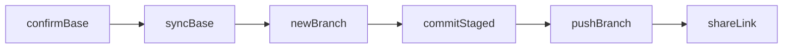

# Prepare repository for GitHub

## When this skill applies

Use this workflow whenever Git/GitHub prep is in scope: **confirming the PR base branch**, **syncing with `git pull`**, **creating a branch from updated base**, **committing staged work**, **pushing** and **sharing a PR/compare link**, plus new GitHub repo setup, connecting `origin`, first push, choosing where PRs land, or clarifying branch and commit conventions.

## End-to-end PR prep workflow

When the user wants this skill **executed** (not only policy advice), follow this order:

| Step | Action | Details |
|------|--------|---------|
| **A** | Confirm **base branch** | See [Target branch (required)](#target-branch-required). Never assume the base silently. |
| **B** | **Checkout base** and **pull** | `git fetch <remote>` (usually `origin`), `git checkout <base>`, then `git pull` to fast-forward the base. **Default:** merge-style pull. If the user or repo prefers a linear history on the base, use `git pull --rebase` instead. For stricter safety (fail if not fast-forward), prefer `git pull --ff-only` after fetch. |
| **C** | **Create a new branch** | From the updated `<base>`: `git checkout -b <topic-branch>`. See [Branch names (when creating branches)](#branch-names-when-creating-branches). |
| **D** | **Commit** | If there are **staged** changes, commit with a message derived from **`git diff --cached`** (see [Commit messages](#commit-messages)). If only unstaged changes exist, **ask** whether to stage them or stop with “stage first.” If nothing is staged and the user does not want to stage, **do not** create an empty commit. |
| **E** | **Push** | `git push -u <remote> <topic-branch>` (commonly `git push -u origin <topic-branch>`). If the remote is not named `origin`, use the name from `git remote -v`. |
| **F** | **PR / compare link** | After push, give a GitHub compare URL. Resolve `owner/repo` from `git remote get-url origin` (HTTPS or SSH). Pattern: `https://github.com/<owner>/<repo>/compare/<base>...<head>?expand=1` where `<head>` is the pushed branch name. Users can also open **Compare & pull request** from the GitHub UI after push. |

### Edge cases

- **Merge conflicts on pull:** Stop, report the conflicted paths, and do not force; the user must resolve (or choose merge vs. abort) before continuing.
- **Uncommitted or staged work when switching to `<base>`:** Git may refuse checkout or carry changes. If checkout is unsafe, **stash** (with user consent) or ask the user to commit/stash/discard before switching—do not discard work without explicit instruction.
- **Detached HEAD:** Checkout a real branch (`<base>` or a new topic branch) before committing; avoid leaving new commits only on detached HEAD unless the user asks.
- **No `origin` or unusual remote:** Use `git remote -v` to name the remote and URL; adjust push and compare links accordingly.
- **First push of the branch:** `git push -u` sets upstream so later `git push` / `git pull` work as expected.

## Read-only vs mutating Git commands

- **Advice-only** (explaining defaults, branch strategy, conventions): Prefer **read-only** commands (`git branch`, `git status`, `git log`, `git remote -v`, etc.).
- **Full PR prep workflow** (above): **Mutating** commands are expected: `checkout`, `pull`, `branch`/`checkout -b`, `commit`, `push`. Do **not** run destructive operations such as `reset --hard`, forced branch updates, or `push --force` unless the user **explicitly** requests them.

## Target branch (required)

**Always ask the user which branch is the target** for integration (PRs, default push, “mainline” work). Never pick a target branch silently.

Present a **suggested default** using the rules below, then ask for confirmation or an override.

### Default suggestion rules

| Local situation | Suggested default | Ask the user |
|-----------------|-------------------|--------------|
| Only `main` exists | `main` | Confirm, e.g. “Only `main` exists; use `main` as the target branch?” |
| `main` plus **exactly one** of `staging`, `dev`, `develop` | That non-`main` branch | Confirm with that name as default |
| `main` plus **two or more** of `staging`, `dev`, `develop` | *(none)* | **Must ask** which branch is the target—do not auto-pick |
| Anything else (no `main`, only feature branches, empty repo, unusual layout) | *(none)* | Ask explicitly which branch is the target |

After the user confirms the target branch, treat it as the default for PR base and push destination unless they say otherwise.

### How to detect branches (read-only)

Prefer **local** branch names first.

1. List local branches: `git branch --list` or `git show-ref --heads` (parse ref names under `refs/heads/`).
2. Normalize names: strip leading `*` and whitespace; compare case-sensitively as Git does.
3. Count which of `main`, `staging`, `dev`, `develop` exist locally.
4. If there are **no local branches** yet (e.g. new clone with no checkout), fall back to `git branch -r` or `git ls-remote --heads origin` only to inform the question—still **ask** the user which branch is the target.

## Branch names (when creating branches)

- Prefer clear prefixes when appropriate: `feature/…`, `fix/…`, `chore/…`, or ticket IDs if the repo already uses them (infer from existing branch names).
- If team convention is unclear, **ask once** how branches should be named, then follow that.

## Commit messages

- Derive the subject and body from what will be committed—typically **`git diff --cached`** after staging. If the user explicitly wants a commit that includes unstaged changes, base the message on the full relevant diff they intend to include.
- Default suggestion: [Conventional Commits](https://www.conventionalcommits.org/) (`feat:`, `fix:`, `docs:`, etc.) with a short subject line.
- If `CONTRIBUTING.md`, `git log`, or project docs show a different style, **follow the repository’s existing convention** instead.

## After target branch is set

- Base new work and PRs on the confirmed target branch unless the user specifies a different base.
- When giving push/PR instructions, name the remote branch and PR base explicitly using the chosen target.
